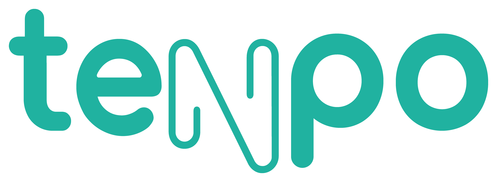

## Acces Tenpo

Acces Tenpo es el proyecto-desafío final del Bootcamp Laboratoria realizado con el soporte de Tenpo PrePago.
[Acces Tenpo](https://tenpo-hack.web.app/)

### Problema propuesta:

#### Apertura de cuenta remota para personas con habilidades diferentes:

¿Cómo podemos lograr que una persona con habilidades diferentes puedan lograr la apertura de una cuenta remota con Tenpo? En este contexto podríamos lograr que pueda cumplir sus obligaciones financieras con una herramienta mucho más amigable.

### Nuestra solución

Nuestra solución se dirije a personas con capacidad reducida de visión y consiste en la posibilidad de aumentar el contraste, aumentar la letra.

#### Tiempo de desarrollo

6 días

## Definición del producto

Es una app web móvil diseñada facilitar la apertura de cuenta remota en la app Tenpo a las personas con habilidades visuales diversas.

## Descripción del proyecto

Incorporar una extensión con opciones que cubran las necesidades de estos usuarios. generando una personalización del aplicativo. Tales como: reconocimiento por voz, lector de pantalla, manejo del contraste, adaptación del tamaño de los textos.

## Definición UX

### Definición de Usuario 👥

#### Historias de usuario

#### Definición de hecho

### Prototipo 💻

- [Prototipo de alta fidelidad en Figma]().

### Testeo con Usuarios

### Lighthouse

### Interfaz de usuario UI

#### La interfaz permite:

- aumentar el texto
- aumentar el contraste
- lector de pantalla
- dictado a texto

## Tecnologías Utilizadas 👾

- [Javascript](https://developer.mozilla.org/es/docs/Web/JavaScript).

- [React](https://es.reactjs.org).

- [React-router-DOM](https://reacttraining.com/react-router/web/guides/quick-start).

- [HTML](https://developer.mozilla.org/es/docs/Web/HTML).

- [CSS](https://developer.mozilla.org/es/docs/Web/CSS).

- [Firebase](https://firebase.google.com/?hl=es).

- [Git](https://git-scm.com/).

- [Bootstrap](https://getbootstrap.com).

### Dependencias

- [ACCESSIBILITY](https://www.npmjs.com/package/accessibility)

### Developers

- [Camila Osores - Front-end dev](https://github.com/camila-osores)
- [Camila Perez - UX Designer](https://github.com/CamiPerezv)
- [Monica Bartha - Front-end dev](https://github.com/MonicaBartha)
- [Vianny Reyes - Front-end dev](https://github.com/revaldivieso)
