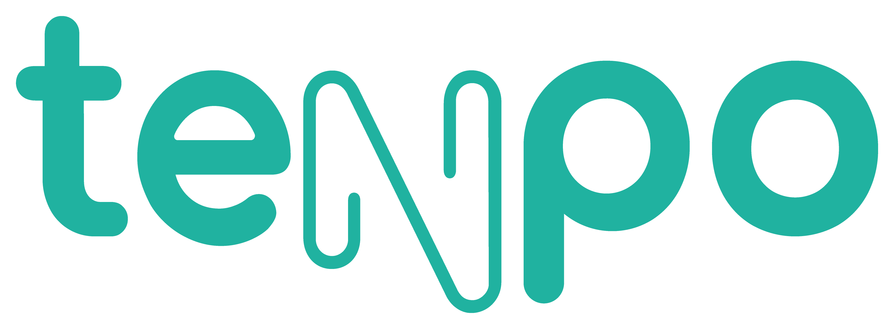
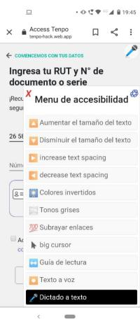
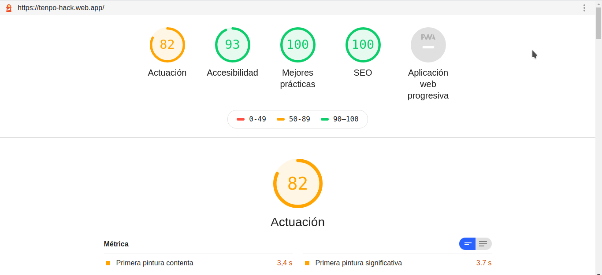

## Acces Tenpo

[Acces Tenpo](https://tenpo-hack.web.app/)

## Definición de Usuario 👥

es una app web móvil diseñada facilitar la apertura de cuenta remota en la app Tenpo a las personas con habilidades visuales diversas.

## Descripcion del proyecto

Incorporar una extensión con opciones que cubran las necesidades de estos usuarios. generando una personalización del aplicativo. Tales como: reconocimiento por voz, manejo del contraste, adaptación del tamaño de los textos.

## Prototipo 💻

- [Prototipo de alta fidelidad en Figma]().

## Testeo con Usuarios

## Lighthouse

## Tecnologías Utilizadas 👾

- [Javascript](https://developer.mozilla.org/es/docs/Web/JavaScript).

- [React](https://es.reactjs.org).

- [React-router-DOM](https://reacttraining.com/react-router/web/guides/quick-start).

- [HTML](https://developer.mozilla.org/es/docs/Web/HTML).

- [CSS](https://developer.mozilla.org/es/docs/Web/CSS).

- [Firebase](https://firebase.google.com/?hl=es).

- [Git](https://git-scm.com/).

- [Bootstrap](https://getbootstrap.com).

### Dependencias

- [ACCESSIBILITY](https://www.npmjs.com/package/accessibility)

### Developers
